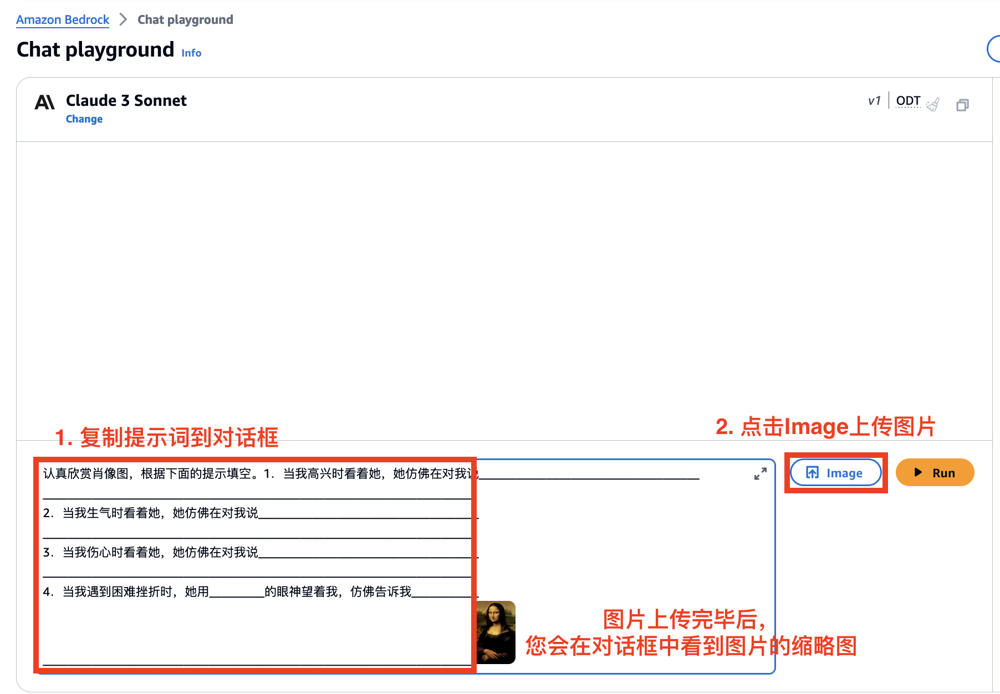
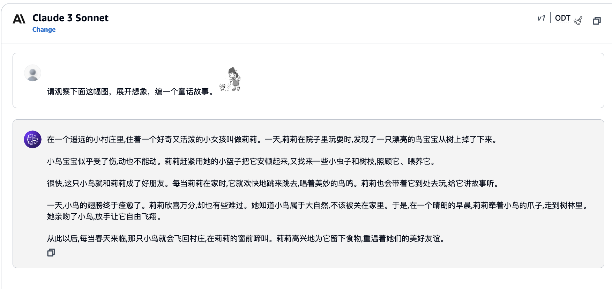

# 看图写话

在本次实验中，您将体验 Claude3 的多模态能力。

多模态大模型能够同时处理不同形式的输入,如文本、图像等,并生成相应的输出。这种能力使其在各种场景下都有广泛的应用前景,如视觉问答、图像描述、内容审核等。

本次实验将重点关注 Claude3 在"看图写话"任务中的表现。

## 前置需求

1. 请确保您已配置好 Claude3 模型的访问权限并登录到 Bedrock 控制台，具体步骤可参考[01\_配置 Bedrock 模型访问权限](../01_前置需求/01_配置Bedrock模型访问权限.md)

2. 您可以选择 Claude 3 Sonnet 或 Claude 3 Haiku 完成本次实验。下列示例以 Sonnet 为例。

## 示例一

选择好 Claude 3 Sonnet 模型后，将下列提示词复制到对话框中，然后点击 Image 上传给定图片，接着点击运行。您也可以根据自己的理解修改提示词。



提示词

```
1．当我高兴时看着她，她仿佛在对我说____________________________________
______________________________________________________________________。
2．当我生气时看着她，她仿佛在对我说____________________________________
______________________________________________________________________。
3．当我伤心时看着她，她仿佛在对我说____________________________________
______________________________________________________________________。
4．当我遇到困难挫折时，她用_________的眼神望着我，仿佛告诉我___________
______________________________________________________________________。
```

图片


结果


## 示例二

如下图，可点击小刷子按钮清除历史对话信息


将下列提示词复制到对话框中，然后点击 Image 上传给定图片，接着点击运行。您也可以根据自己的理解修改提示词。

提示词

```
请观察下面这幅图，展开想象，编一个童话故事。
```

图片


结果


